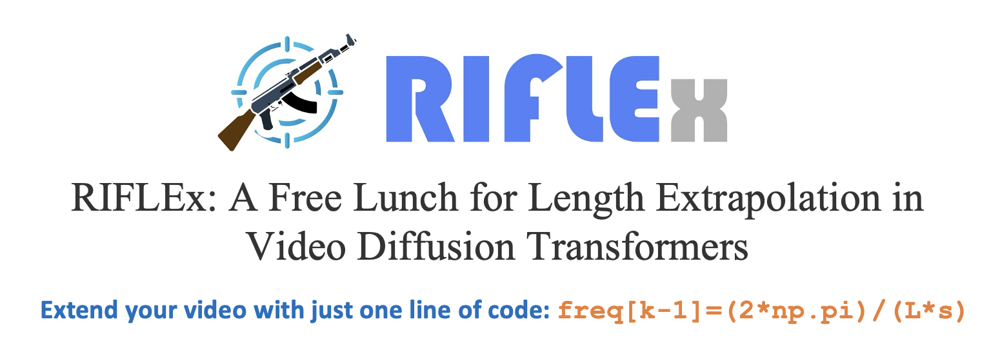

<div align="center">
</img>
<h1>RIFLEx: A Free Lunch for Length Extrapolation in
Video Diffusion Transformers</h1>

<div>
    <a href="https://gracezhao1997.github.io/" target="_blank">Min Zhao</a><sup></sup> | 
    <a href="https://guandehe.github.io/" target="_blank">Guande He</a><sup></sup> | 
    <a href="https://github.com/Chyxx" target="_blank">Yixiao Chen</a><sup></sup> | 
    <a href="https://zhuhz22.github.io/" target="_blank">Hongzhou Zhu</a><sup></sup>|
<a href="https://zhenxuan00.github.io/" target="_blank">Chongxuan Li</a><sup></sup> | 
    <a href="https://ml.cs.tsinghua.edu.cn/~jun/index.shtml" target="_blank">Jun Zhu</a><sup></sup>
</div>
<div>
    <sup></sup>Tsinghua University
</div>


[Paper](https://arxiv.org/pdf/xxx.xxx.pdf) | [Project Page](https://riflex-video.github.io/) | [Video](https://www.youtube.com/watch?v=taofoXDsKGk) 


</div>

---

## RIFLEx Code
RIFLEx only adds a single line of code on the original [1D RoPE](https://github.com/huggingface/diffusers/blob/9c7e205176c30b27c5f44ec7650a8dfcc12dde86/src/diffusers/models/embeddings.py#L1105).
```python
def get_1d_rotary_pos_embed_riflex(
    dim: int,
    pos: Union[np.ndarray, int],
    theta: float = 10000.0,
    k: Optional[int] = None,
    L_test: Optional[int] = None,
):
    '''
        k: the index for the intrinsic frequency in RoPE
        L_test: the number of frames for inference
    '''
    
    assert dim % 2 == 0
    if isinstance(pos, int):
        pos = torch.arange(pos)
    if isinstance(pos, np.ndarray):
        pos = torch.from_numpy(pos)
    freqs = 1.0 / (theta ** (torch.arange(0, dim, 2, device=pos.device)[: (dim // 2)].float() / dim)) 

    # === RIFLEx modification start ===
    # Reduce intrinsic frequency to stay within a single period after extrapolation (Eq.(8)).
    # Empirical observations show that a few videos may exhibit repetition in the tail frames.
    # To be conservative, we multiply 0.9 to keep extrapolated length below 90% of a period. 
    freqs[k-1] = 0.9 * 2 * torch.pi / L_test
    # === RIFLEx modification end ===

    freqs = torch.outer(pos, freqs)  
    freqs_cos = freqs.cos().repeat_interleave(2, dim=1).float()  
    freqs_sin = freqs.sin().repeat_interleave(2, dim=1).float()  
    return freqs_cos, freqs_sin
```
## Inference with Diffusers
#### Installation
```bash
conda create -n rifle python=3.10
pip install -r requirements.txt
```
#### Single GPU
For training-free 2× temporal extrapolation in HunyuanVideo: 
```bash
python hunyuanvideo.py --k 4 --N_k 50 --num_frames 261 
```
For finetuned 2× temporal extrapolation in HunyuanVideo: 
```bash
python hunyuanvideo.py --k 4 --N_k 50 --num_frames 261 --finetune --model_id "zhuhz22/HunyuanVideo_RIFLEx"
```

## Ackowledgements
This repo are based on [Diffusers](https://github.com/huggingface/diffusers/tree/main),[HunyuanVideo](https://github.com/Tencent/HunyuanVideo),[CogvideoX](https://github.com/THUDM/CogVideo/tree/7b4c9db6d9178b2953f48c233b5e1ea77c0757da) and [FreeU](https://github.com/ChenyangSi/FreeU).